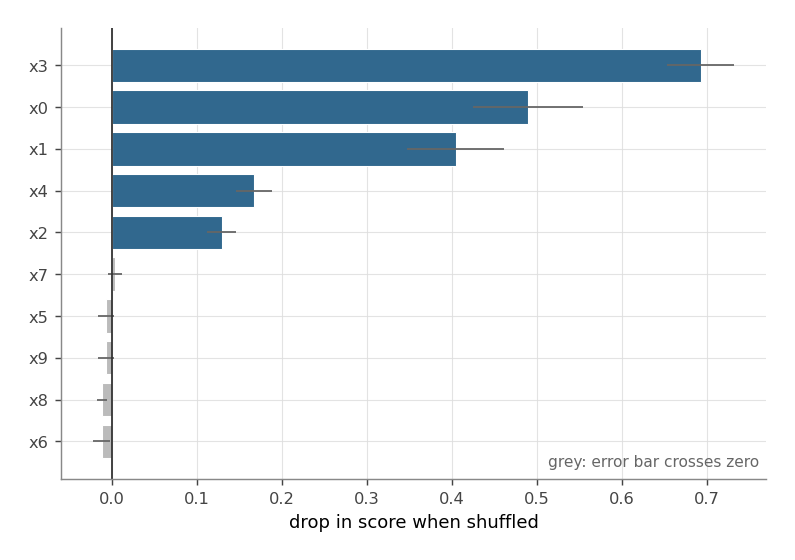
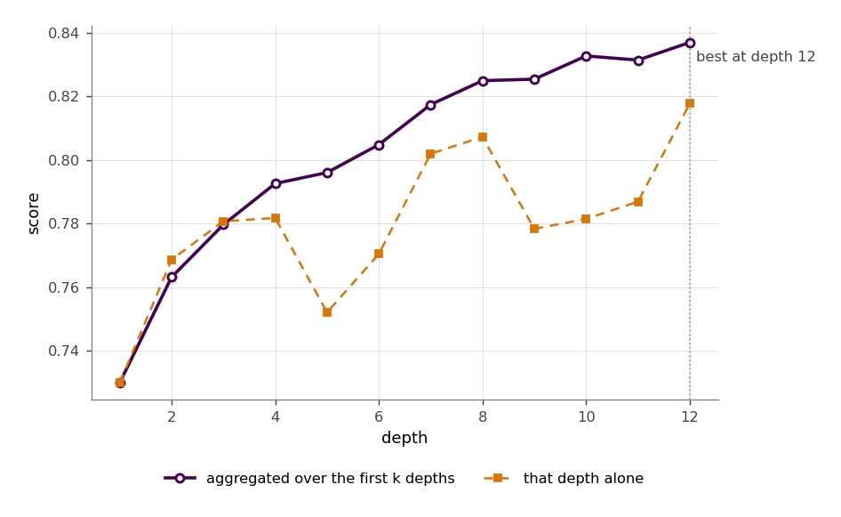
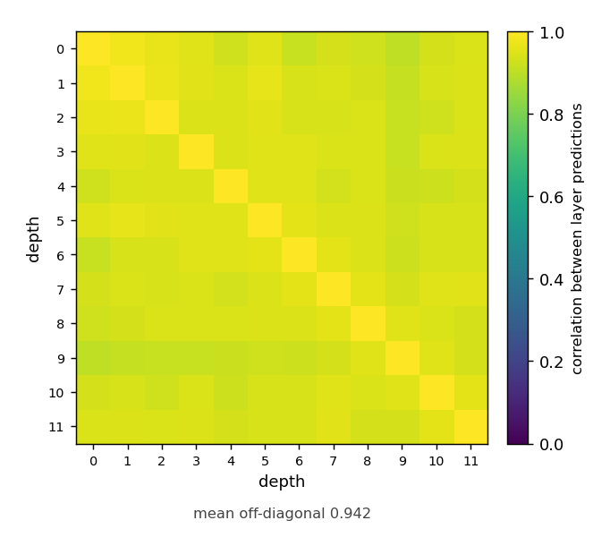
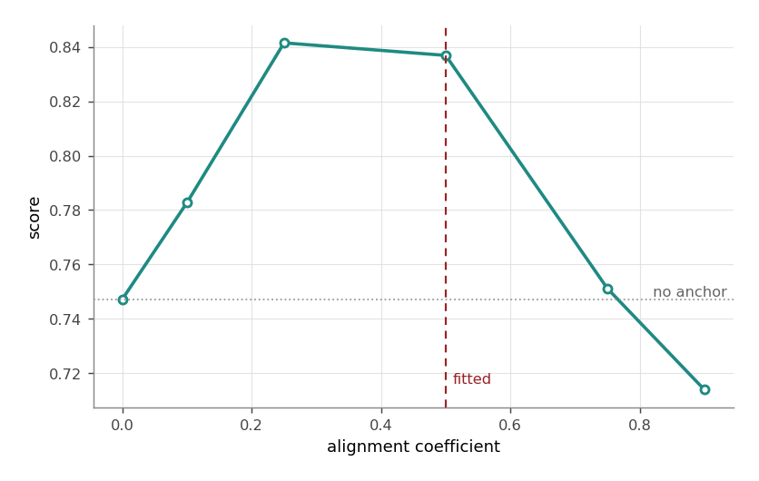
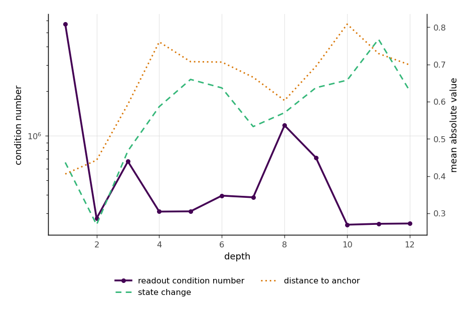
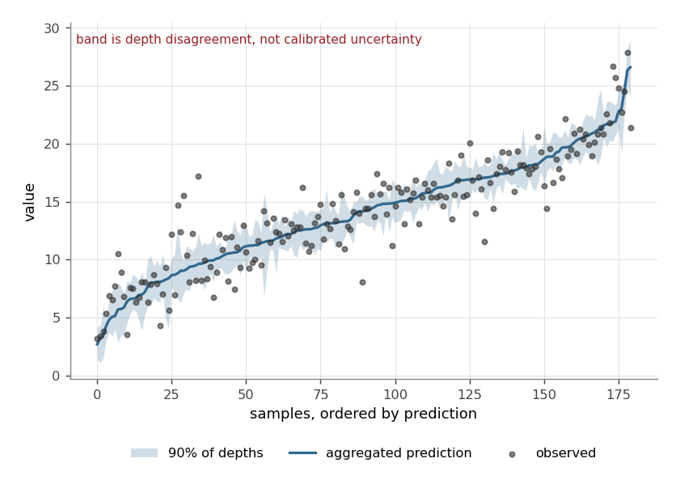

Interpretability gallery
========================

Every figure here is produced by ``python docs/make_gallery.py``, which fits a
model on ``make_friedman1`` and calls the same public functions the rest of this
documentation describes. Nothing is drawn by hand.

.. code-block:: python

   from sklearn.datasets import make_friedman1
   from sklearn.model_selection import train_test_split
   from lairnet import LAIRNetRegressor, inspection, plotting

   X, y = make_friedman1(n_samples=600, noise=1.0, random_state=0)
   Xtr, Xte, ytr, yte = train_test_split(X, y, test_size=0.3, random_state=0)
   model = LAIRNetRegressor(n_hidden=60, n_layers=12, random_state=0).fit(Xtr, ytr)

Friedman-1 is a useful example because the answer is known: the response uses
``x0``–``x4`` and ignores ``x5``–``x9``, so a tool that claims otherwise is
wrong rather than interesting.

Plotting needs matplotlib, which is an optional extra:

.. code-block:: bash

   pip install lairnet[plots]

Which features the model uses
-----------------------------

.. code-block:: python

   result = inspection.permutation_importance(model, Xte, yte, n_repeats=10)
   plotting.plot_feature_importance(result)

.. container:: figure-read

   The five informative features separate from the five noise features. Bars
   whose error bar crosses zero are greyed out and labelled, because an
   importance that has not been distinguished from noise should not be ranked
   confidently just because it happens to sort above another one.

Whether depth is helping
------------------------

.. code-block:: python

   curve = inspection.depth_curve(model, Xte, yte)
   plotting.plot_depth_path(curve)
   curve.best_depth

.. container:: figure-read

   Two lines: the score from aggregating the first *k* depths, and the score
   from depth *k* on its own. The gap between them is what aggregation buys. If
   the aggregated line flattens well before the last depth, the extra layers are
   not paying for themselves and ``n_layers`` should come down.

   This costs one forward pass, not ``n_layers`` refits.

How much the depths disagree
----------------------------

.. code-block:: python

   agreement = inspection.layer_agreement(model, Xte)
   plotting.plot_layer_agreement(agreement)
   agreement.mean_correlation      # 0.942 here

.. container:: figure-read

   Near-uniform high correlation means the depths are close to duplicates, so
   averaging them recovers far less variance than independent errors would. That
   is expected rather than wrong: the alignment impulse pulls every layer
   towards the same anchor, so it *makes* them correlated. It is the reason the
   median aggregator is a robustness choice rather than a variance-reduction
   one.

What the anchor is worth
------------------------

.. code-block:: python

   sweep = inspection.align_sensitivity(model, Xtr, ytr,
                                        X_valid=Xte, y_valid=yte)
   plotting.plot_anchor_alignment(sweep)
   sweep.anchor_gain

.. container:: figure-read

   At ``align=0`` the anchor cannot reach the prediction at all, so the height
   of the curve above that point is what the target-aware component is worth on
   this data. A flat curve means the model is working as a plain leaky
   randomized stack and the anchor is doing nothing.

   This one **refits**, once per value, so it costs what it looks like it costs.

Whether the readouts are well conditioned
-----------------------------------------

.. code-block:: python

   plotting.plot_layer_diagnostics(model)
   model.layer_conditions_, model.layer_solvers_

.. container:: figure-read

   Three quantities against depth. A condition number climbing with depth means
   the readouts are becoming sensitive to the data; any depth that fell back
   from Cholesky to an eigendecomposition is circled, because that is the solver
   saying it did not trust the fast path. A state change collapsing towards zero
   means the stack has stopped moving and the remaining depths are duplicates.

Where the depths disagree, per sample
-------------------------------------

.. code-block:: python

   plotting.plot_prediction_band(model, Xte, yte)
   lower, upper = model.prediction_band(Xte, coverage=0.9)

.. warning::
   :class: not-uncertainty

   This band is **depth disagreement, not calibrated uncertainty**. It describes
   how much the depths of one fitted model disagree about each sample. It
   carries no coverage guarantee, and it will not widen for a sample far outside
   the training data unless the depths happen to disagree there. Do not read it
   as a confidence or prediction interval.

All of it at once
-----------------

.. code-block:: python

   from lairnet.explain import explain_model

   report = explain_model(model, Xtr, ytr, Xte, yte,
                          align_values=(0.0, 0.25, 0.5, 0.75))
   print(report.summary())

.. code-block:: text

   score on the evaluation data: 0.8369

   features the model uses
     feature 3                +0.6931 +/- 0.0397
     feature 0                +0.4900 +/- 0.0644
     feature 1                +0.4049 +/- 0.0570
     feature 4                +0.1672 +/- 0.0209
     feature 2                +0.1291 +/- 0.0169

   depth
     best at depth 12 of 12
     aggregating all depths is worth +0.1069 over one
     depths correlate 0.942 on average, so aggregation recovers less variance
     than independent errors would give

   anchor
     with anchor    0.8369
     without anchor 0.7472
     the anchor is worth +0.0897 here
     best alignment coefficient tested: 0.25 (fitted at 0.5)

   numerics
     readout condition numbers 2.51e+05 to 5.68e+06

Called without held-out data, ``explain_model`` still works and prints a note
saying every score above it is measured on the training data. The summary is
readable enough that someone will paste it into a report, so it says so itself
rather than relying on the caller to remember.

``ModelExplanation`` also carries every underlying result object, so anything in
the summary can be plotted or inspected further.
