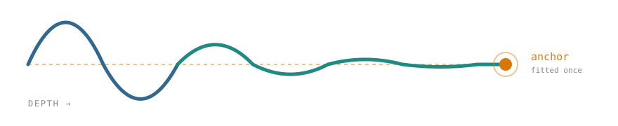

:html_theme.sidebar_secondary.remove: true

.. container:: hero-eyebrow

   RANDOMIZED NETWORKS · TABULAR REGRESSION · CLOSED-FORM READOUTS

.. rst-class:: landing

A randomized network you can **steer**, and then **see inside**
===============================================================

.. container:: hero-lede

   A shallow network fitted to your target supplies an *anchor*. A stack of
   fixed random layers is run with every layer pulled part-way back towards
   it, and a ridge readout is fitted at every depth. Nothing backpropagates
   through the stack — so it trains in seconds, and it tells you what it did.

.. container:: hero-install

   .. code-block:: bash

      pip install lairnet

.. grid:: 1 1 2 2
   :gutter: 3
   :class-container: split-hero

   .. grid-item::

      .. code-block:: python

         from lairnet import LAIRNetRegressor

         model = LAIRNetRegressor().fit(X_train, y_train)
         model.predict(X_test)

         # and then, unlike most randomized networks:
         model.anchor_converged_      # did the anchor fit converge?
         model.layer_conditions_      # how well conditioned is each readout?
         model.layer_predictions(X)   # what did every depth predict?

   .. grid-item::

      .. image:: _static/gallery/depth_path.png
         :alt: score against depth, aggregated and per layer
         :class: hero-figure

.. container:: section-lead

   Start here

.. grid:: 1 2 2 4
   :gutter: 3
   :class-container: model-cards

   .. grid-item-card:: Install
      :link: installation
      :link-type: doc
      :class-card: stack-card

      Core, plus optional speed, plotting and docs extras.

   .. grid-item-card:: Quick start
      :link: quickstart
      :link-type: doc
      :class-card: anchor-card

      Fit, predict, and read the diagnostics.

   .. grid-item-card:: Notebooks
      :link: usage
      :link-type: doc
      :class-card: stack-card

      Four executed walkthroughs, outputs and all.

   .. grid-item-card:: API
      :link: api
      :link-type: doc
      :class-card: anchor-card

      Every public name, one page per module.

.. container:: section-lead

   What it gives you that a fit does not

.. grid:: 1 1 2 2
   :gutter: 3
   :class-container: model-cards

   .. grid-item-card:: See which features it uses
      :link: gallery
      :link-type: doc
      :class-card: stack-card

      Permutation importance on held-out data, with any bar whose error crosses
      zero greyed out — because an importance not distinguished from noise
      should not be ranked confidently.

   .. grid-item-card:: See whether depth is helping
      :link: gallery
      :link-type: doc
      :class-card: anchor-card

      One forward pass gives the score from aggregating the first *k* depths,
      for every *k*. If the curve flattens early, the extra layers are not
      paying for themselves.

   .. grid-item-card:: See what the anchor is worth
      :link: gallery
      :link-type: doc
      :class-card: stack-card

      Refit at ``align=0`` and compare. A flat curve means the target-aware
      component is doing nothing on your data, and the package will say so
      rather than let you assume otherwise.

   .. grid-item-card:: See when it did not converge
      :link: usage
      :link-type: doc
      :class-card: anchor-card

      A capped anchor fit warns. A capped fit is an unlabelled regularisation
      choice, and silently returning one is the defect this package was built
      to avoid.

.. container:: section-lead

   Built on measurement, not taste

.. grid:: 1 3 3 3
   :gutter: 3
   :class-container: stat-cards

   .. grid-item-card:: ``backend="auto"``

      NumPy below 5000 samples, numba above, on a threshold read off a benchmark
      that runs at the package's own settings. torch is faster still and
      deliberately never automatic.

   .. grid-item-card:: Closed-form readouts

      One Cholesky per depth on a Gram matrix whose fixed block is built once
      for the whole stack, with an eigendecomposition fallback and a reported
      condition number.

   .. grid-item-card:: Honest diagnostics

      The optimiser's own status, not a guess from the iteration count. Where a
      backend reports none, the package says so instead of inferring one.

.. container:: section-lead

   Reading the whole model in one call

.. code-block:: python

   from lairnet.explain import explain_model

   print(explain_model(model, X_train, y_train, X_test, y_test).summary())

.. code-block:: text

   score on the evaluation data: 0.8369

   features the model uses
     feature 3                +0.6931 +/- 0.0397
     feature 0                +0.4900 +/- 0.0644
     ...

   depth
     best at depth 12 of 12
     aggregating all depths is worth +0.1069 over one
     depths correlate 0.942 on average, so aggregation recovers less variance
     than independent errors would give

   anchor
     with anchor    0.8369
     without anchor 0.7472
     the anchor is worth +0.0897 here

Called without held-out data it still works, and prints a note saying every
score above it is measured on the training data.

.. toctree::
   :hidden:

   installation
   quickstart
   usage
   gallery
   api
   development
